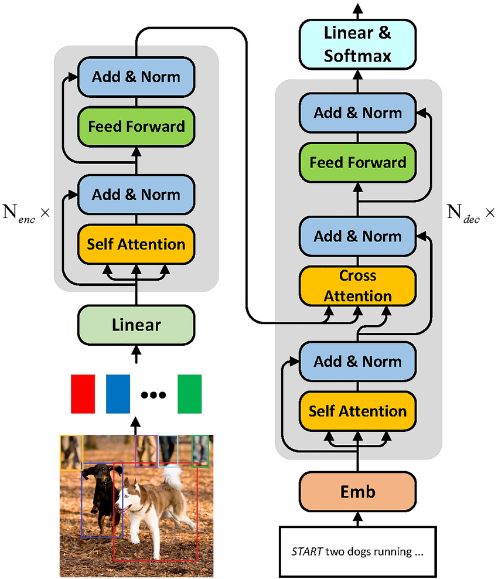
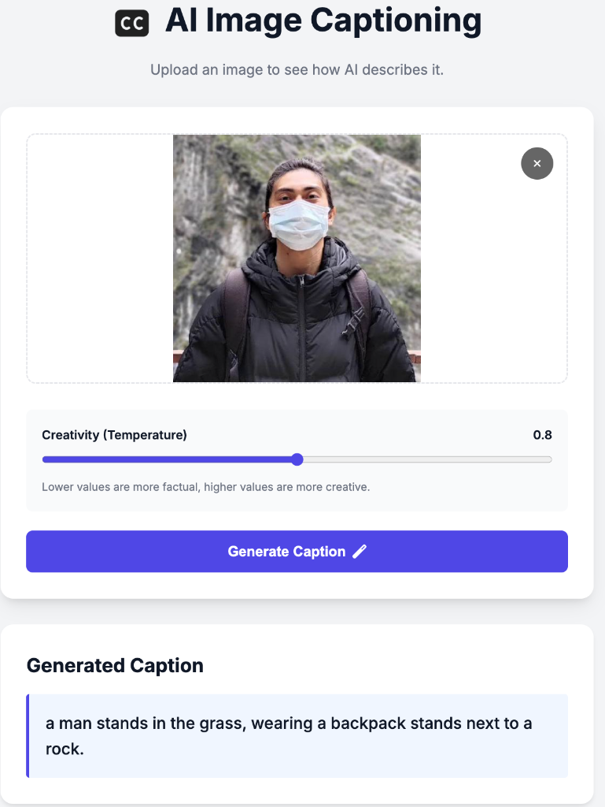
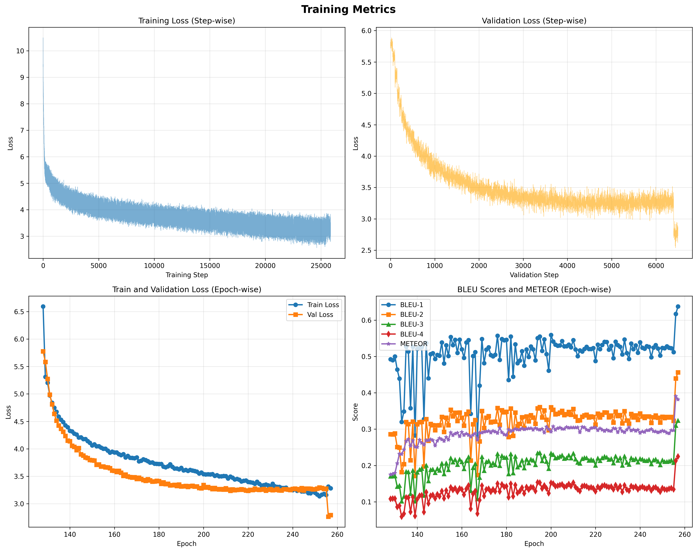

# Image Captioning with Vision Transformers

## Overview
This project implements an **image captioning model** using **Vision Transformers (ViTs)** and a GPT-based decoder. The model is trained on the **Flickr 30k dataset** to generate natural language descriptions for images. The application features a modern web interface for easy interaction and is deployed using Docker.

## Architecture
The model uses a Vision Transformer (ViT) as the encoder to extract features from images and a Transformer Decoder (GPT-style) to generate captions.



## Application Demo
The web application allows users to upload images and adjust the creativity (temperature) of the caption generation.



## Training Metrics
The model was trained on the Flickr 30k dataset. Below are the training metrics showing Loss, BLEU scores, and METEOR scores over epochs.



[View Interactive Training Dashboard](plots/training_metrics_interactive.html)

## Project Structure
```
.
├── app.py                  # Flask application entry point
├── requirements.txt        # Project dependencies
├── Dockerfile              # Docker configuration
├── model_weights.pt        # Trained model weights
├── vision/                 # Core model code
│   ├── model/              # Encoder, Decoder, and Attention modules
│   ├── inference/          # Inference logic
│   └── train/              # Training scripts
├── templates/              # HTML templates
│   └── index.html          # Main application page
├── static/                 # Static assets (CSS, JS, Images)
│   ├── css/                # Stylesheets
│   ├── js/                 # JavaScript files
│   └── images/             # Images for README and App
└── plots/                  # Training visualization plots
```

## Installation
### Prerequisites
- Python 3.8+
- Docker (optional)

### Setup
1. **Clone the repository**:
   ```bash
   git clone https://github.com/natek-1/Vision-Transformer-for-image-captioning.git
   cd Vision-Transformer-for-image-captioning
   ```
2. **Install dependencies**:
   ```bash
   pip install -r requirements.txt
   ```
3. **Run the application**:
   ```bash
   python app.py
   ```
   Open [http://localhost:5000](http://localhost:5000) in your browser.

## Reference

[Thanks for Luke Ditria's Video Explaining hoow to build image captioining models](https://youtu.be/SLta_XCHf5E?si=19KsK-mBC7XLTus-)

## License
MIT License
