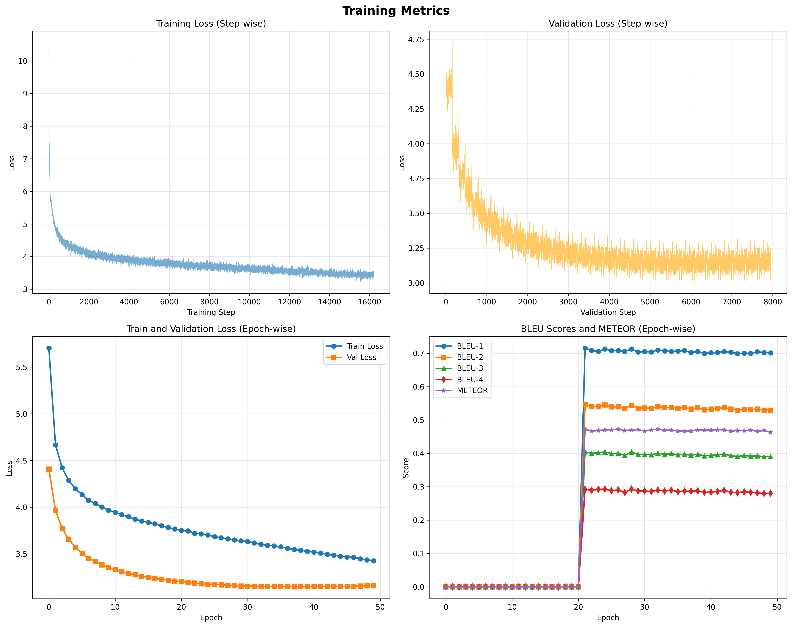

# 🖼️ Image Captioning with Vision Transformers

Generate natural-language descriptions of images using a **Vision Transformer (ViT) encoder** paired with a **GPT-style autoregressive Transformer decoder**, trained end-to-end on the **MS-COCO** dataset.

> **🚀 Live Demo:** [Try it on Hugging Face Spaces](https://huggingface.co/spaces/natek-1/vision-transformer-image-captioning)
> _Upload any image and get an instant caption._

<!-- Replace the link above with your actual Space URL once published (see "Deploy to Hugging Face Spaces" below). -->

---

## 📌 Overview

This project implements an **encoder–decoder image captioning model** from the ground up:

- A **pretrained ViT** (`google/vit-large-patch16-224-in21k`) extracts rich visual features from the image.
- A **custom Transformer decoder** (GPT-2 style, causal self-attention with cross-attention to image features) generates the caption one token at a time.
- The model is trained on **MS-COCO 2014** (~120K images, 5 captions each) and evaluated with **BLEU** and **METEOR**.

The repository includes the full training pipeline, a Flask web app for inference, and a Docker image for reproducible, CPU-only deployment.

---

## 🏆 Results

Trained for **50 epochs** on MS-COCO 2014. Best checkpoint selected by validation **METEOR** score.

| Metric   | Score  |
|----------|--------|
| BLEU-1   | ~0.71  |
| BLEU-2   | ~0.54  |
| BLEU-3   | ~0.40  |
| BLEU-4   | ~0.29  |
| METEOR   | ~0.47  |

These results are competitive with the reference paper's ViT+GPT architecture on COCO.

### Training curves



**How to read these plots:**
- **Top row (step-wise loss):** Both training and validation loss drop sharply in the first ~2K steps and converge smoothly — training loss to ~3.4, validation loss to ~3.2 — with no divergence between the two, indicating the model generalizes rather than overfits.
- **Bottom-left (epoch-wise loss):** Train and validation loss track each other closely throughout all 50 epochs. The small, stable gap is a healthy sign of good regularization.
- **Bottom-right (BLEU & METEOR):** Caption-quality metrics were enabled partway through training (~epoch 21) and immediately plateau at strong values, staying flat and stable for the rest of training — the model reaches its quality ceiling and holds it.

---

## 🧠 Architecture

```
                 ┌─────────────────────────┐
   Image ───────▶│  ViT-Large Encoder       │  (frozen, pretrained on ImageNet-21k)
                 │  google/vit-large-...    │
                 └───────────┬─────────────┘
                             │ patch embeddings (1024-d)
                             ▼
                 ┌─────────────────────────┐
                 │  Linear projection       │  1024 → 512 hidden size
                 └───────────┬─────────────┘
                             │ image memory
                             ▼
   Caption ─────▶┌─────────────────────────┐
   tokens        │  Transformer Decoder     │  12 layers, 8 heads, causal + cross-attn
                 │  (GPT-2 style)           │  pre-norm, dropout, label smoothing
                 └───────────┬─────────────┘
                             ▼
                        Next-token logits ──▶ caption text
```

| Component        | Choice                                        |
|------------------|-----------------------------------------------|
| Vision encoder   | `google/vit-large-patch16-224-in21k` (frozen) |
| Text decoder     | Custom `nn.TransformerDecoder`, GPT-2 style   |
| Tokenizer        | `distilbert-base-uncased` (WordPiece)         |
| Hidden size      | 512                                           |
| Decoder layers   | 12                                            |
| Attention heads  | 8                                             |
| Max caption len  | 70 tokens                                     |

---

## 🔑 Key Design Decisions

- **Frozen ViT encoder.** The pretrained ViT is frozen during training. This dramatically reduces the number of trainable parameters, speeds up training, and avoids catastrophic forgetting of the strong visual features learned on ImageNet-21k — only the projection layer and decoder are trained.
- **From-scratch GPT-style decoder.** Rather than fine-tuning a large pretrained language model, a compact 12-layer decoder is trained from scratch. This keeps the model small, fully controllable, and easy to reason about, while still capturing COCO's caption distribution.
- **Cross-attention over projected patch embeddings.** The decoder attends to the full sequence of ViT patch tokens (projected to 512-d) via cross-attention, giving it fine-grained spatial context instead of a single pooled vector.
- **Regularization for generalization.** Uses **label smoothing (0.1)**, **token dropout (`TokenDrop`, p=0.5)** on caption inputs, and **weight decay** — reflected in the tight train/val loss gap in the plots above.
- **METEOR-based checkpoint selection.** The best model is chosen by validation METEOR (which correlates better with human judgment of caption quality) rather than raw loss.
- **Reproducible, CPU-only inference image.** Dependencies are **version-pinned** (`transformers==4.57.3`) because the ViT `state_dict` layer naming changed across `transformers` releases — pinning guarantees the saved checkpoint loads correctly inside the container.

---

## ⚙️ Training Configuration

| Hyperparameter     | Value                          |
|--------------------|--------------------------------|
| Dataset            | MS-COCO 2014 (train + val)     |
| Epochs             | 50                             |
| Batch size         | 256                            |
| Optimizer          | AdamW (lr 1e-4, wd 1e-4)       |
| Loss               | Cross-entropy + label smoothing 0.1 |
| Mixed precision    | Yes (AMP / GradScaler)         |
| Image resolution   | 224 × 224                      |
| Seed               | 42 (reproducible)              |

---

## 🚀 Quickstart

### Run inference locally

```bash
# 1. Create environment
conda create -n image_captioning python=3.10 -y
conda activate image_captioning
pip install -r requirements.txt

# 2. Run the web app
python app.py
```

Then open <http://localhost:5000> and upload an image.

### Run inference with Docker (CPU-only)

A lean, inference-only image is provided via `Dockerfile.inference`:

```bash
# Build
docker build -f Dockerfile.inference -t image-captioning-inference .

# Run (mount a volume to cache Hugging Face model downloads)
docker run -p 5000:5000 -v hf-cache:/app/.cache/huggingface image-captioning-inference
```

The container ships only the runtime dependencies needed for `app.py` (no training stack) and runs entirely on CPU.

---

## 🏋️ Training the Model

1. **Download MS-COCO 2014** from the [COCO website](https://cocodataset.org/#download) (train2014, val2014, and the caption annotations).
2. Place the data under `datasets/` with the expected `train2014/`, `val2014/`, and `annotations/` structure.
3. Launch training:
   ```bash
   python vision/main.py
   ```
   Checkpoints are saved to `checkpoints/`, and the best-METEOR model is written to `checkpoints/best_meteor_model.pt`. Training/validation plots are regenerated automatically on completion.

---

## 🌐 Deploy to Hugging Face Spaces (Gradio — free)

A ready-to-use Gradio app (`gradio_app.py`) is provided so the model can be
hosted on a **free** Hugging Face Gradio Space (Docker Spaces require a paid tier).

1. Create a new **Space** at <https://huggingface.co/new-space> with **SDK: Gradio**.
2. Add this Space metadata to the top of the Space's `README.md` (or set it in the UI):
   ```yaml
   ---
   title: Vision Transformer Image Captioning
   emoji: 🖼️
   sdk: gradio
   app_file: gradio_app.py
   ---
   ```
3. Push the app to the Space repo:
   - `gradio_app.py`
   - the `vision/` package
   - `requirements.gradio.txt` **copied to `requirements.txt`** (HF Spaces install
     from a file named exactly `requirements.txt`).
4. **Weights are downloaded automatically at startup** from the public Hub repo
   [`ngkuissi/vit-vit-large-patch16-224-in21k-gpt-2-w-cross-attention`](https://huggingface.co/ngkuissi/vit-vit-large-patch16-224-in21k-gpt-2-w-cross-attention),
   so nothing extra needs to be uploaded to the Space. To use a different repo,
   set the Space variables `MODEL_REPO_ID` and (optionally) `MODEL_FILENAME`.
5. Once the Space builds, update the **Live Demo** link at the top of this README.

### Run the Gradio app locally

```bash
pip install -r requirements.gradio.txt
python gradio_app.py
```

Then open <http://localhost:7860>.

---

## 🗂️ Project Structure

```
├── app.py                     # Flask inference web app
├── gradio_app.py              # Gradio demo app (free HF Spaces)
├── Dockerfile.inference       # CPU-only inference image
├── requirements.inference.txt # Pinned runtime deps for the container
├── requirements.gradio.txt    # Pinned deps for the Gradio Space
├── requirements.txt           # Full (training) dependencies
├── plotsv2/                   # Training metric plots
├── vision/
│   ├── model/                 # ViT encoder, GPT-style decoder, caption model
│   ├── train/                 # Training / validation loops
│   ├── dataset/               # COCO dataset + collation
│   ├── inference/             # Caption generation utilities
│   ├── utils.py               # Scheduler, checkpointing, visualizations
│   └── main.py                # Training entry point
├── templates/ & static/       # Web UI
└── best_meteor_model.pt       # Trained weights (best validation METEOR)
```

---

## 📚 Reference

Based on the following paper:

**S. Mishra et al.**, *Image Caption Generation using Vision Transformer and GPT Architecture*,
2024 2nd International Conference on Advancement in Computation & Computer Technologies (InCACCT), Gharuan, India, 2024, pp. 1–6.
[DOI: 10.1109/InCACCT61598.2024.10551257](https://doi.org/10.1109/InCACCT61598.2024.10551257)

```bibtex
@inproceedings{mishra2024image,
  author    = {S. Mishra and others},
  title     = {Image Caption Generation using Vision Transformer and GPT Architecture},
  booktitle = {2024 2nd International Conference on Advancement in Computation & Computer Technologies (InCACCT)},
  year      = {2024},
  pages     = {1--6},
  doi       = {10.1109/InCACCT61598.2024.10551257},
  keywords  = {Image Captioning, Vision Transformer, GPT-2, Encoder-Decoder}
}
```

---

**Author:** Nathan Gabriel Kuissi · [GitHub](https://github.com/natek-1)
